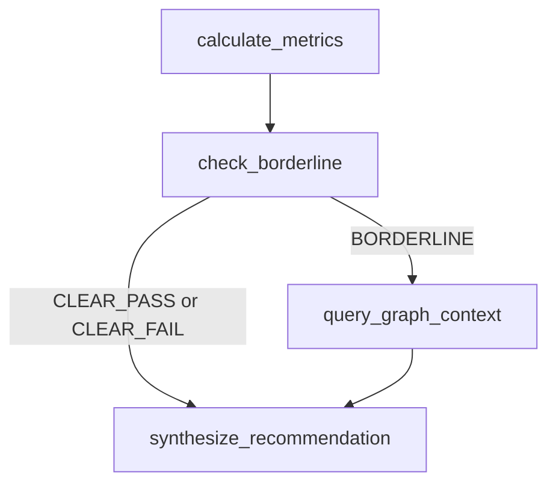

# Risk Scoring Subgraph Design

## Why a Subgraph
The current `risk_scoring_node` combines deterministic calculations, optional context lookups, and synthesis in one node. A subgraph extraction makes the flow explicit and easier to test when risk logic grows.

## Proposed Internal Steps
1. `calculate_metrics`
2. `check_borderline`
3. `query_graph_context` (conditional)
4. `synthesize_recommendation`

### Step Detail
- `calculate_metrics`: run DTI/LTV/FICO/employment checks and build base criterion scores.
- `check_borderline`: classify the case (`CLEAR_PASS`, `CLEAR_FAIL`, `BORDERLINE`) from computed metrics.
- `query_graph_context`: only runs for `BORDERLINE`; fetches industry/similar-loan context.
- `synthesize_recommendation`: merges deterministic metrics plus optional graph context into a final `RiskAssessment`.

## Subgraph State vs Parent State

### Parent State (`UnderwritingState`)
- Broad orchestration state across fetch/doc/risk/compliance/human/final nodes.
- Contains all pipeline outputs plus routing flags.

### Subgraph State (proposed `RiskScoringSubgraphState`)
- Narrow risk-only state:
  - `borrower_package`
  - `document_review`
  - `criteria_scores`
  - `borderline_classification`
  - `industry_context`
  - `risk_assessment`
  - `needs_manual_review`
  - `errors`

## Parent/Subgraph Mapping

### Parent -> Subgraph Input Mapping
- `parent.borrower_package -> subgraph.borrower_package`
- `parent.document_review -> subgraph.document_review`
- `parent.errors -> subgraph.errors`

### Subgraph -> Parent Output Mapping
- `subgraph.risk_assessment -> parent.risk_assessment`
- `subgraph.needs_manual_review -> parent.needs_manual_review`
- `subgraph.errors -> parent.errors` (append/merge)

## When Extraction Is Justified
Extract risk scoring into a subgraph when one or more thresholds are hit:
- More than 4 internal decision branches in risk logic.
- More than 2 conditional context lookups (graph/RAG variants).
- More than 2 teams modifying risk logic in parallel.
- Risk scoring node exceeds ~200 lines or becomes hard to unit test directly.
- You need independent risk replay/versioning without changing parent graph topology.

## Subgraph Diagram

## Integration Pattern
Use the subgraph as a single parent node (`risk_scoring`) to keep outer orchestration stable while evolving inner risk complexity.
