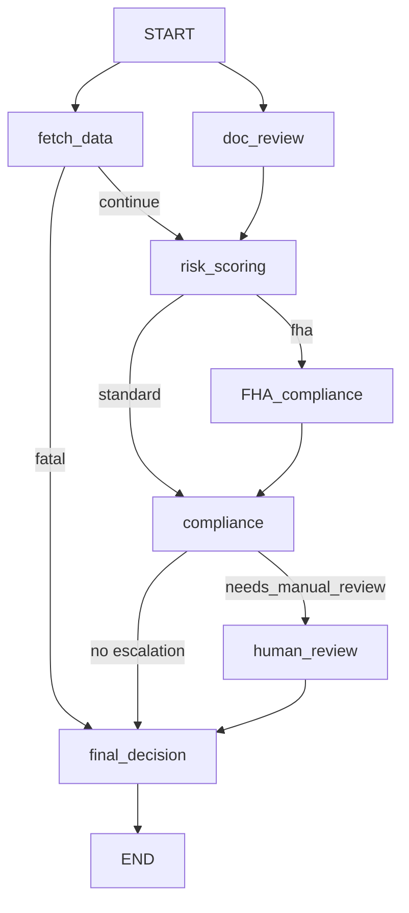

# Orchestrator SKILL

## Purpose
The orchestrator coordinates four underwriting agents in a production-style LangGraph flow with explicit state, routing, error handling, and human-in-the-loop support.

## Core Graph

## Node Responsibilities
- `fetch_data`: build `borrower_package` and data-quality metadata.
- `doc_review`: classify/extract/validate docs or return `SKIPPED` when no docs.
- `risk_scoring`: combine borrower + doc review + policy/graph context into `risk_assessment`.
- `fha_compliance`: optional FHA-specific checks before standard compliance.
- `compliance`: legal/regulatory validation and escalation override.
- `human_review`: interrupt/resume for manual decision capture.
- `final_decision`: unified report + audit trail.

## State Requirements
- Shared state includes all agent outputs and control fields.
- `errors` uses `Annotated[list[str], add]`.
- `messages` uses `Annotated[list, add_messages]`.
- Audit fields must include per-node completion timestamps.
- `graph_version` must be set on every execution for future versioning.

## Routing Rules
- After `fetch_data`: route to final decision when borrower package is missing.
- After `compliance`: route to human review when `needs_manual_review` is true.
- `loan_type` may branch risk flow (for example `fha -> fha_compliance`).

## Reliability Rules
- Every node wraps work in try/except and writes failures to `errors`.
- Graph compiles with `MemorySaver` in development.
- Use persistent checkpoint backend (Redis) in production.
